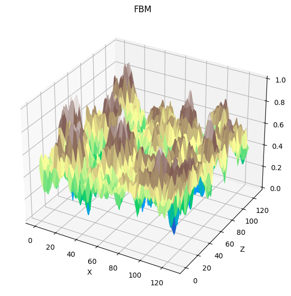
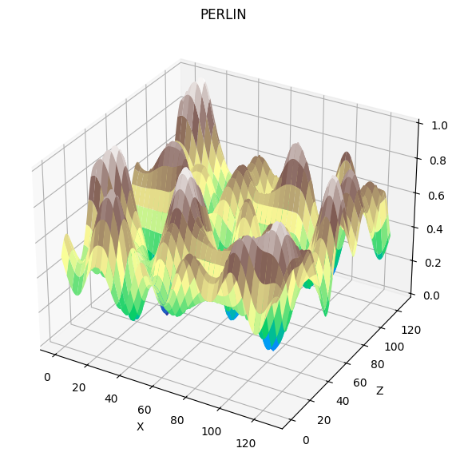
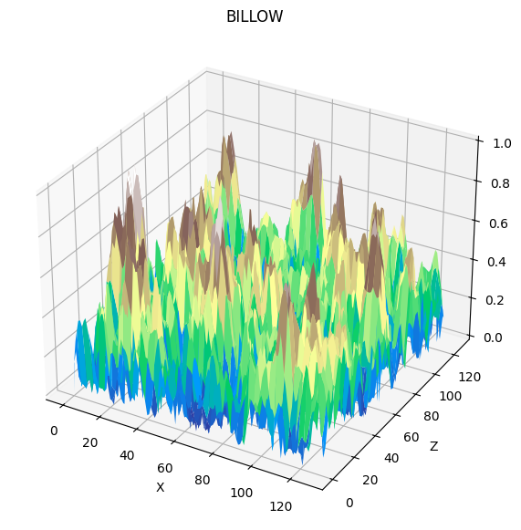
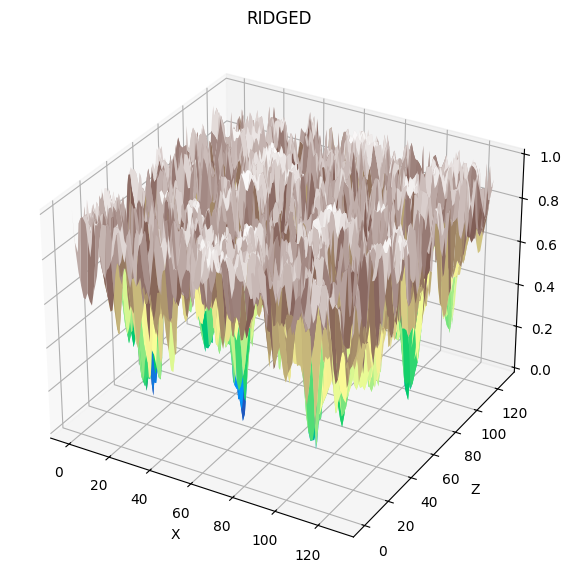

# procedural_terrain
Minimal procedural terrain generation with 3D mesh export, render & visualization.

 

## Features
- Procedural heightmap generation using fractal noise
- Convert heightmaps to 3D mesh (OBJ format)
- Render the 3D mesh using **Ursina Engine**
- Static visualization in **Jupyter Notebook**
- Configurable via <code>config.yaml</code>

## Dependencies
- Numpy
- Matplotlib
- Noise
- Pyyaml
- Ursina

## Usage
1. Visualize in **Jupyter Notebook**:
    - Open <code>visualization.ipynb</code>. The notebook generates an illustration of the terrain in a simple 3D graph:
    
     

2. Generate & export mesh:
    - ```bash
        python generate.py
        ```
    - This will produce an OBJ file in <code>meshes/</code> that can eventually be rendered in **Blender** or **Meshlab**

3. Render using generated mesh:
    - ```bash
        python render.py
        ```
    - This will render the mesh in a 3D environment that is possible to view in first person.

## License
MIT License